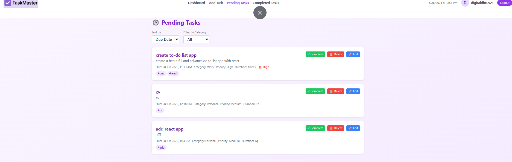
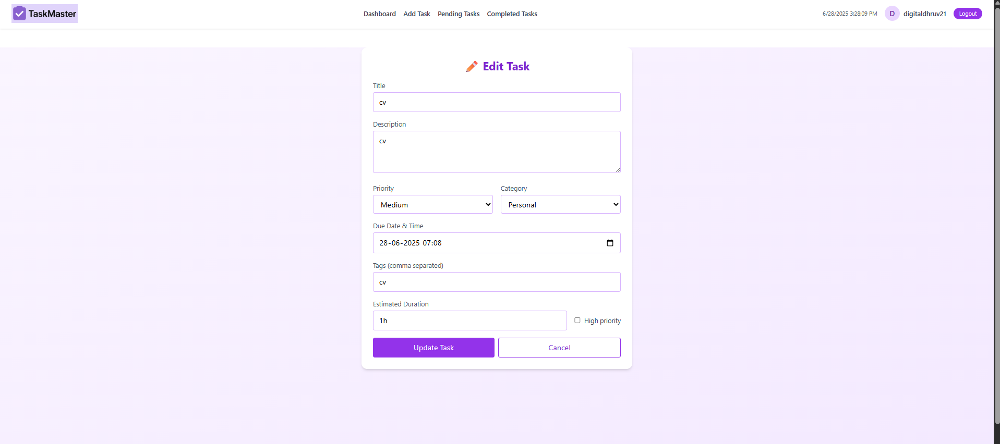
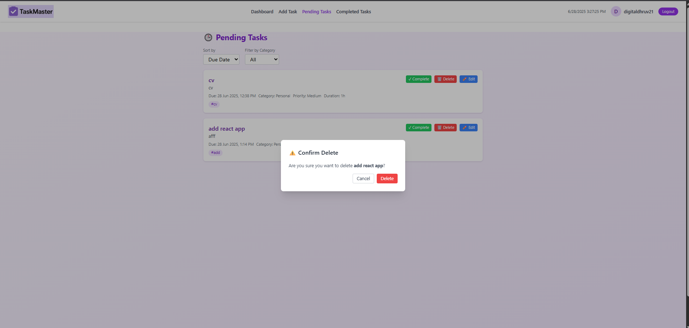

# 🚀 Task Master — Advanced To-Do List App

> **A modern, professional, feature-rich to-do list app built with React, Tailwind CSS, and Firebase.**  
> Organize your tasks, boost productivity, and track progress with enterprise-grade security.


---

## ✨ **Features**

✅ User authentication (Google & Email/Password)  
✅ Add, edit, delete tasks with categories, priority & tags  
✅ Live preview while adding/editing  
✅ High priority toggle  
✅ Dashboard with:
- Total, completed & pending counts
- Completion rate
- Latest tasks list
- Motivational quotes widget (with author & new quote button)
  
✅ Export tasks to CSV  
✅ Delete confirm modal  
✅ Fully responsive design with Tailwind v3  
✅ Firebase Firestore integration  
✅ Professional UI, smooth fade animations

---

## 🛠️ Tech Stack

| Category | Technology | Purpose |
|----------|------------|---------|
| **Frontend** | React 19.1.0 | Modern UI framework |
| **Styling** | Tailwind CSS 3.4.17 | Utility-first CSS framework |
| **Backend** | Firebase 11.9.1 | Authentication & Database |
| **Build Tool** | Vite 7.0.0 | Fast development & building |
| **Charts** | Chart.js 4.5.0 | Data visualization |
| **Animations** | Framer Motion 12.19.2 | Smooth UI animations |
| **Notifications** | React Hot Toast 2.5.2 | User feedback |
| **Routing** | React Router DOM 7.6.3 | Client-side routing |
| **Data Export** | PapaParse 5.5.3 | CSV parsing & export |

---

## 📸 Screenshots

> *Replace these with your actual screenshots:*

| Login | Dashboard | Add Task |
|--|--|--|
|  |  |  |

| Pending Tasks | Edit Task | Delete Confirm |
|--|--|--|
|  |  |  |

---

## ⚙️ Installation & Setup

### 📋 **Prerequisites**
- Node.js 18+ and npm
- Firebase account
- Git

### 🚀 **Quick Start**

#### 1️⃣ **Clone the Repository**
```bash
git clone https://github.com/dhruvpatel16120/Task-master.git
cd task-master
```

#### 2️⃣ **Install Dependencies**
```bash
npm install
```

#### 3️⃣ **Environment Configuration**
```bash
# Copy environment template
touch .env

# Edit .env with your Firebase credentials
nano .env
```

#### 4️⃣ **Firebase Setup**
1. Go to [Firebase Console](https://console.firebase.google.com/)
2. Create a new project
3. Enable Authentication (Email/Password & Google)
4. Create Firestore database
5. Copy your Firebase config to `.env`

#### 5️⃣ **Security Validation**
```bash
# Run security audit
npm run security-audit

# Run full security check
npm run security-check
```

#### 6️⃣ **Start Development**
```bash
npm run dev
```

Visit `http://localhost:5173` to see your app!

---

## 🔧 Configuration

### 📝 **Environment Variables**

Create a `.env` file with the following variables:

```bash
# Firebase Configuration
VITE_FIREBASE_API_KEY=your_api_key_here
VITE_FIREBASE_AUTH_DOMAIN=your_project.firebaseapp.com
VITE_FIREBASE_PROJECT_ID=your_project_id
VITE_FIREBASE_STORAGE_BUCKET=your_project.appspot.com
VITE_FIREBASE_MESSAGING_SENDER_ID=your_sender_id
VITE_FIREBASE_APP_ID=your_app_id
VITE_FIREBASE_MEASUREMENT_ID=your_measurement_id

# Security Configuration
VITE_ENABLE_DEBUG_MODE=false
VITE_ENABLE_ERROR_TRACKING=true
VITE_ERROR_TRACKING_SERVICE=sentry

# Feature Flags
VITE_ENABLE_ANALYTICS=true
VITE_ENABLE_PWA=true

# API Configuration
VITE_API_TIMEOUT=30000
VITE_MAX_FILE_SIZE=5242880
```

### 🔐 **Firebase Security Rules**

Add these Firestore security rules:

```javascript
rules_version = '2';
service cloud.firestore {
  match /databases/{database}/documents {
    // Users can only access their own data
    match /users/{userId} {
      allow read, write: if request.auth != null && request.auth.uid == userId;
    }
    
    // Tasks belong to users
    match /tasks/{taskId} {
      allow read, write: if request.auth != null && 
        request.auth.uid == resource.data.uid;
    }
  }
}
```

---

### 🔒 **Security Commands**
```bash
# Run security audit
npm run security-audit

# Run full security check (lint + audit)
npm run security-check

# Run before commits
npm run pre-commit
```

### 📊 **Available Scripts**
```bash
npm run dev          # Start development server
npm run build        # Build for production
npm run preview      # Preview production build
npm run lint         # Run ESLint
npm run security-audit # Security vulnerability scan
```

---

## 🔍 Security & Quality

### 🛡️ **Security Features**

#### **Authentication & Authorization**
- **Multi-factor Authentication** - Google OAuth + Email/Password
- **Rate Limiting** - 5 login attempts per 15 minutes
- **Session Management** - Secure persistence with automatic timeout
- **Password Policies** - Minimum 8 characters with complexity requirements

#### **Data Protection**
- **Input Sanitization** - XSS prevention through HTML sanitization
- **Validation** - Comprehensive input validation for all user data
- **Encryption** - Data encrypted in transit and at rest
- **Access Control** - User data isolation and permission-based access

#### **Infrastructure Security**
- **Environment Variables** - No hardcoded secrets
- **Content Security Policy** - Strict CSP headers
- **Error Handling** - Secure error messages without data exposure
- **Audit Logging** - Comprehensive security event logging

### 🔧 **Code Quality**

#### **Automated Checks**
```bash
# Code Quality
npm run lint                    # ESLint with security rules
npm run security-audit         # Vulnerability scanning
npm run security-check         # Full security validation

# Pre-commit Hooks
npm run pre-commit             # Automated quality gates
```

#### **Quality Standards**
- **ESLint Security Rules** - Enforce secure coding practices
- **No Console Logs** - Production-safe logging
- **Type Safety** - Comprehensive input validation
- **Error Boundaries** - Graceful error handling

---

## 📚 API Documentation

### 🔐 **Authentication Endpoints**

#### **Login**
```javascript
// Email/Password Login
const login = async (email, password) => {
  const result = await signInWithEmailAndPassword(auth, email, password);
  return result.user;
};

// Google OAuth Login
const googleLogin = async () => {
  const result = await signInWithPopup(auth, googleProvider);
  return result.user;
};
```

#### **Password Reset**
```javascript
const resetPassword = async (email) => {
  await sendPasswordResetEmail(auth, email);
};
```

### 📝 **Task Management API**

#### **Create Task**
```javascript
const createTask = async (taskData) => {
  const sanitizedData = sanitizeTaskData(taskData);
  const docRef = await addDoc(collection(db, "tasks"), {
    uid: user.uid,
    ...sanitizedData,
    createdAt: serverTimestamp()
  });
  return docRef;
};
```

#### **Update Task**
```javascript
const updateTask = async (taskId, updates) => {
  const sanitizedUpdates = sanitizeTaskData(updates);
  await updateDoc(doc(db, "tasks", taskId), {
    ...sanitizedUpdates,
    updatedAt: serverTimestamp()
  });
};
```

#### **Delete Task**
```javascript
const deleteTask = async (taskId) => {
  await deleteDoc(doc(db, "tasks", taskId));
};
```

### 🔍 **Query Examples**

#### **Get User Tasks**
```javascript
const getUserTasks = async (userId) => {
  const q = query(
    collection(db, "tasks"),
    where("uid", "==", userId),
    orderBy("createdAt", "desc")
  );
  const snapshot = await getDocs(q);
  return snapshot.docs.map(doc => ({ id: doc.id, ...doc.data() }));
};
```

#### **Filter Tasks**
```javascript
const getFilteredTasks = async (userId, filters) => {
  let q = query(collection(db, "tasks"), where("uid", "==", userId));
  
  if (filters.category) {
    q = query(q, where("category", "==", filters.category));
  }
  
  if (filters.completed !== undefined) {
    q = query(q, where("completed", "==", filters.completed));
  }
  
  const snapshot = await getDocs(q);
  return snapshot.docs.map(doc => ({ id: doc.id, ...doc.data() }));
};
```

---

## 🤝 Contributing

We welcome contributions! Please follow these guidelines:

### 📋 **Contribution Process**

1. **Fork the repository**
2. **Create a feature branch** (`git checkout -b feature/amazing-feature`)
3. **Make your changes** following our coding standards
4. **Run security checks** (`npm run security-check`)
5. **Commit your changes** (`git commit -m 'Add amazing feature'`)
6. **Push to the branch** (`git push origin feature/amazing-feature`)
7. **Open a Pull Request**

### 🔧 **Development Setup**

```bash
# Clone your fork
git clone https://github.com/dhruvpatel16120/Task-master.git
cd task-master

# Install dependencies
npm install

# Set up environment
touch .env
# Edit .env with your Firebase credentials

# Run security checks
npm run security-check

# Start development
npm run dev
```

### 📝 **Coding Standards**

- **ESLint Rules** - Follow the configured ESLint rules
- **Security First** - Always validate and sanitize inputs
- **Error Handling** - Use the centralized error handler
- **Documentation** - Comment complex logic and update docs
- **Testing** - Add tests for new features

### 🐛 **Reporting Issues**

When reporting issues, please include:
- **Description** - Clear description of the problem
- **Steps to Reproduce** - Detailed reproduction steps
- **Expected Behavior** - What you expected to happen
- **Actual Behavior** - What actually happened
- **Environment** - Browser, OS, and version information

---

## 📄 License

This project is licensed under the MIT License - see the [LICENSE](LICENSE) file for details.

### 📊 **Project Statistics**

> *Note: These badges will show actual data once the repository is published to GitHub*


---

## 🙏 **Acknowledgments**

- **Firebase** - For providing excellent backend services
- **React Team** - For the amazing React framework
- **Tailwind CSS** - For the utility-first CSS framework
- **Vite** - For the fast build tool
- **Contributors** - Everyone who contributed to this project

---

## 📞 **Support**

- **Documentation** - Check this README and inline code comments
- **Issues** - Report bugs and request features via GitHub Issues
- **Discussions** - Join the conversation in GitHub Discussions
- **Security** - Report security vulnerabilities privately

---

**Made with ❤️ by the Task Master Team**

*Organize your life, one task at a time.*
